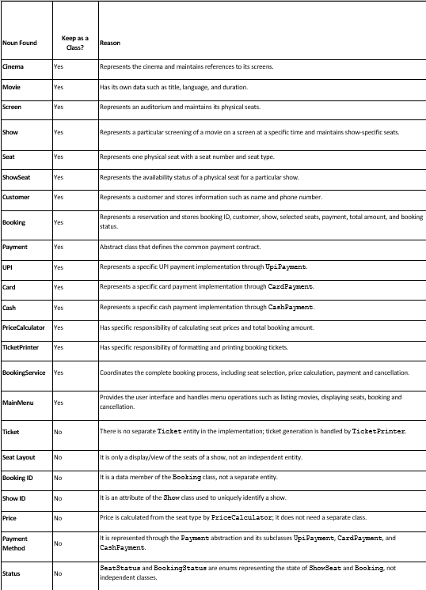

# MovieTicketBookingSystem

A console-based **Movie Ticket Booking System** built in C++ demonstrating core **Object-Oriented Programming (OOP)** concepts and basic **System Design principles** — similar to how PVR or INOX works, but for a single cinema.

---

## How to Run

> **Requirements:** Any C++ compiler that supports C++17 (g++ recommended)

### Step 1 — Go to the project folder

Open PowerShell and navigate to the project folder:

```powershell
cd C:\Users\DELL\Downloads\MovieTicketBookingSystem
```

### Step 2 — Compile

```powershell
g++ main.cpp -o MovieTicketBookingSystem.exe
```

### Step 3 — Run

```powershell
.\MovieTicketBookingSystem.exe
```

---

## Functional & Non-Functional Requirements

### Functional Requirements (FR)

* **FR1:** The system shall display all movies currently playing in the cinema.

* **FR2:** The system shall display the available shows, including screen and start time, for a selected movie.

* **FR3:** The system shall display the seat layout of a selected show, with each seat marked as **AVAILABLE** or **BOOKED**.

* **FR4:** The system shall allow the customer to book one or more available seats and reject any seat that is already booked.

* **FR5:** The system shall calculate the total booking amount according to the seat type:

| Seat Type | Price |
| --------- | ----: |
| SILVER    |  ₹150 |
| GOLD      |  ₹250 |
| PLATINUM  |  ₹400 |

* **FR6:** The system shall accept payment through **UPI, Card, or Cash** and shall not confirm the booking if the payment fails.

* **FR7:** The system shall print a ticket containing the booking ID, customer details, movie name, screen, show time, seat numbers, payment method, and total amount.

* **FR8:** The system shall allow a customer to cancel a confirmed booking and make the previously booked seats **AVAILABLE** again.

### Non-Functional Requirements (NFR)

1. **Modularity:** Each class shall have a separate file and a single clear responsibility.

2. **Extensibility:** The system shall allow new payment methods, such as NetBanking, to be added without modifying the existing payment classes or core booking logic.

3. **Input Validation:** The system shall validate menu choices, seat numbers, and booking inputs and display clear error messages without crashing the program.

4. **Maintainability:** Functions shall perform a single clear task, use meaningful names, avoid unnecessary code repetition, and remain reasonably short and easy to understand.

5. **Reliability:** The system shall maintain correct seat availability and shall not mark seats as booked when the corresponding payment fails.

6. **Usability:** The system shall provide a simple menu-driven interface so that customers can easily view movies, select shows, check seats, make bookings, and cancel bookings.

---

## What This Project Does

The system provides a **cinema ticket booking counter** through a simple menu-driven interface. A customer can:

* **List Movies** — View all currently playing movies with their language and duration.
* **List Shows** — Select a movie and view its available shows, including screen and show time.
* **View Seats** — View the seat layout for a selected show, including seat number, seat type, and availability status.
* **Book Seats** — Select one or more available seats, choose a payment method, and receive a printed ticket.
* **Cancel Booking** — Cancel a confirmed booking and make the previously booked seats available again.

---

## Noun-Verb Analysis



---

## Class Design

| Class                  | Attributes / Data Members                                                                     | Methods                                                                                                                                                                                                                 | Responsibility                                                                                                          | Must NOT Do                                                  |
| ---------------------- | --------------------------------------------------------------------------------------------- | ----------------------------------------------------------------------------------------------------------------------------------------------------------------------------------------------------------------------- | ----------------------------------------------------------------------------------------------------------------------- | ------------------------------------------------------------ |
| **Movie**              | `title`, `language`, `duration`                                                               | `getTitle()`, `getLanguage()`, `getDuration()`                                                                                                                                                                          | Stores basic movie information                                                                                          | Handle booking, seat management or payment                   |
| **Seat**               | `seatNumber`, `seatType`                                                                      | `getSeatNumber()`, `getSeatType()`                                                                                                                                                                                      | Represents one physical seat and its category                                                                           | Manage show-specific booking status                          |
| **Screen**             | `screenNumber`, `seats`                                                                       | `addSeat()`, `getSeats()`, `getScreenNumber()`                                                                                                                                                                          | Represents an auditorium and maintains references to physical seats                                                     | Handle booking, payment or price calculation                 |
| **Cinema**             | `name`, `screens`                                                                             | `addScreen()`, `getScreens()`, `listMovies()`                                                                                                                                                                           | Represents the cinema and maintains its screens                                                                         | Calculate prices, process payments or manage bookings        |
| **Show**               | `showId`, `movie`, `screen`, `startTime`, `showSeats`                                         | `addShowSeat()`, `findShowSeat()`, `displaySeats()`, `getShowId()`, `getMovie()`, `getScreen()`, `getStartTime()`, `getShowSeats()`                                                                                     | Represents one movie screening at a particular time and maintains show-specific seat objects                            | Process payments or create bookings                          |
| **ShowSeat**           | `seat`, `status`                                                                              | `isAvailable()`, `isBooked()`, `bookSeat()`, `releaseSeat()`, `getSeat()`                                                                                                                                               | Maintains availability status of a particular physical seat for one specific show                                       | Calculate booking price or process payment                   |
| **Customer**           | `name`, `phone`                                                                               | `getName()`, `getPhone()`                                                                                                                                                                                               | Stores customer information                                                                                             | Manage seats, bookings or payments                           |
| **Booking**            | `bookingId`, `customer`, `show`, `seats`, `payment`, `totalAmount`, `status`                  | `confirmBooking()`, `failBooking()`, `cancelBooking()`, `getBookingId()`, `getCustomer()`, `getShow()`, `getSeats()`, `getPayment()`, `getTotalAmount()`, `getStatus()`, `getStatusString()`                            | Stores booking details and manages its booking state                                                                    | Calculate prices, implement payment methods or print tickets |
| **Payment (Abstract)** | —                                                                                             | `pay(amount)`, `getMethodName()`                                                                                                                                                                                        | Defines the common interface/contract for all payment methods                                                           | Implement specific UPI, card or cash payment logic           |
| **UpiPayment**         | `upiId`                                                                                       | `pay(amount)`, `getMethodName()`                                                                                                                                                                                        | Processes UPI payment and simulates payment success/failure                                                             | Manage bookings, seats or print tickets                      |
| **CardPayment**        | `cardNumber`                                                                                  | `pay(amount)`, `getMethodName()`                                                                                                                                                                                        | Processes card payment and simulates payment success/failure                                                            | Manage bookings, seats or print tickets                      |
| **CashPayment**        | —                                                                                             | `pay(amount)`, `getMethodName()`                                                                                                                                                                                        | Processes cash payment                                                                                                  | Manage bookings or print tickets                             |
| **PriceCalculator**    | —                                                                                             | `getSeatPrice(seatType)`, `calculateTotal(seats)`                                                                                                                                                                       | Calculates total booking price based on seat category                                                                   | Process payment or print tickets                             |
| **TicketPrinter**      | —                                                                                             | `printTicket(booking)`                                                                                                                                                                                                  | Formats and displays the booking ticket                                                                                 | Calculate price, change booking status or process payment    |
| **BookingService**     | `priceCalculator`, `ticketPrinter`                                                            | `bookTicket()`, `cancelBooking()`, `selectSeats()`, `processPayment()`                                                                                                                                                  | Coordinates the complete booking workflow: seat validation → price calculation → payment → booking confirmation/failure | Implement specific UPI/card/cash payment logic               |
| **MainMenu**           | `cinema`, `movies`, `shows`, `bookings`, `priceCalculator`, `ticketPrinter`, `bookingService` | `run()`, `displayMenu()`, `listMovies()`, `listShowsForMovie()`, `findShowById()`, `findBookingById()`, `handleListMovies()`, `handleListShows()`, `handleDisplaySeats()`, `handleBookSeats()`, `handleCancelBooking()` | Provides the user interface and coordinates menu operations                                                             | Contain detailed payment, pricing or seat-management logic   |

---

## Relationships

| Pair                                 | Relationship    | Justification using Lifetime Test                                                                                                                                             |
| ------------------------------------ | --------------- | ----------------------------------------------------------------------------------------------------------------------------------------------------------------------------- |
| **Cinema — Screen**                  | **Aggregation** | Cinema stores pointers to existing Screen objects. Cinema does not create or destroy the screens. If Cinema is destroyed, Screen objects can continue to exist.               |
| **Screen — Seat**                    | **Association** | Screen stores pointers to Seat objects using `vector<Seat*>`. Screen does not create or delete the seats, so Seat objects have an independent lifetime.                       |
| **Show — Movie**                     | **Aggregation** | Show stores a `Movie*` pointing to an existing movie. Show does not own or delete the Movie. If Show is destroyed, the Movie can continue to exist.                           |
| **Show — Screen**                    | **Association** | Show stores a `Screen*` and uses that screen for a particular screening. It does not own or delete the Screen.                                                                |
| **Show — ShowSeat**                  | **Composition** | Show creates its ShowSeat objects using `new ShowSeat(...)` and its destructor deletes them. Therefore, ShowSeat lifetime depends on Show.                                    |
| **ShowSeat — Seat**                  | **Association** | ShowSeat stores a pointer to an existing physical Seat. It does not create or delete the Seat. If ShowSeat is destroyed, the physical Seat continues to exist.                |
| **Booking — Customer**               | **Association** | Booking stores customer information. Destroying a Booking does not imply destruction of the Customer.                                                                         |
| **Booking — ShowSeat**               | **Aggregation** | Booking stores pointers to existing ShowSeat objects. It does not permanently own or destroy them. When a booking is cancelled, the seats are released rather than destroyed. |
| **Booking — Payment**                | **Association** | Booking uses a Payment object to process the transaction. The Payment object is not responsible for owning the Booking or its seats.                                          |
| **Payment — UpiPayment**             | **Inheritance** | UpiPayment is derived from the abstract Payment class and implements its payment functions.                                                                                   |
| **Payment — CardPayment**            | **Inheritance** | CardPayment is a specialized type of Payment and inherits from the abstract Payment class.                                                                                    |
| **Payment — CashPayment**            | **Inheritance** | CashPayment is derived from the abstract Payment class and provides its own payment implementation.                                                                           |
| **BookingService — Booking**         | **Association** | BookingService creates and manages Booking objects during the booking process but does not conceptually own their lifetime.                                                   |
| **BookingService — Payment**         | **Association** | BookingService receives a Payment object and uses it to process the transaction.                                                                                              |
| **BookingService — Show**            | **Association** | BookingService uses a Show to validate and book seats but does not create or destroy the Show.                                                                                |
| **BookingService — PriceCalculator** | **Association** | BookingService uses PriceCalculator to calculate the booking amount but does not own its lifetime.                                                                            |
| **BookingService — TicketPrinter**   | **Association** | BookingService uses TicketPrinter to print the ticket after successful booking but does not own the printer.                                                                  |

---

## Class Diagram


---

## Sequence Diagram


---

## OOP Concepts Demonstrated

| OOP Concept           | Implementation in Project                                                                 | Classes / Example                                               |
| --------------------- | ----------------------------------------------------------------------------------------- | --------------------------------------------------------------- |
| **Encapsulation**     | Data members are kept private and accessed through public methods.                        | `Movie`, `Seat`, `Customer`, `Booking`                          |
| **Abstraction**       | Common payment operations are defined using an abstract `Payment` class.                  | `Payment::pay()`                                                |
| **Inheritance**       | Specific payment classes inherit common properties and methods from `Payment`.            | `UpiPayment`, `CardPayment`, `CashPayment` → `Payment`          |
| **Polymorphism**      | The same `pay()` interface performs payment differently for different payment methods.    | `Payment*` → UPI/Card/Cash                                      |
| **Association**       | Classes interact with other independent classes through references/pointers.              | `Booking` → `Show`, `Payment`                                   |
| **Aggregation**       | A class maintains references to objects that can exist independently.                     | `Cinema` → `Screen`, `Show` → `Movie`                           |
| **Composition**       | A `Show` manages its `ShowSeat` objects as part of the show.                              | `Show` → `ShowSeat`                                             |
| **Constructor**       | Constructors initialize objects with required data.                                       | `Movie()`, `Customer()`, `Booking()`                            |
| **Method Overriding** | Derived payment classes provide their own implementation of the virtual payment function. | `UpiPayment::pay()`, `CardPayment::pay()`, `CashPayment::pay()` |

---

## SOLID Design Principles


---

## Project Structure

```text
MovieTicketBookingSystem/
│
├── docs/
│   ├── Class Diagram.png
│   ├── noun_verb.png
│   ├── Sequence Diagrams.png
│   └── SOLID PRINCIPLES.png
│
├── app.exe
├── Booking.cpp
├── BookingService.cpp
├── CardPayment.cpp
├── CashPayment.cpp
├── Cinema.cpp
├── Customer.cpp
├── Implementation.cpp
├── MainMenu.cpp
├── Movie.cpp
├── Payment.cpp
├── PriceCalculator.cpp
├── Screen.cpp
├── Seat.cpp
├── Show.cpp
├── ShowSeat.cpp
├── TicketPrinter.cpp
├── UpiPayment.cpp
├── main.cpp
│
└── README.md
```

### Folder Description

| File / Folder           | Description                                                              |
| ----------------------- | ------------------------------------------------------------------------ |
| `docs/`                 | Contains project design and software engineering diagrams/documentation  |
| `Class Diagram.png`     | UML class diagram showing classes, attributes, methods and relationships |
| `noun_verb.png`         | Noun-verb analysis used to identify classes and operations               |
| `Sequence Diagrams.png` | Sequence diagrams showing interactions between objects                   |
| `SOLID PRINCIPLES.png`  | Documentation showing application of SOLID principles                    |
| `Implementation.cpp`    | Contains the main implementations of the project classes                 |
| `Booking.cpp`           | Defines the Booking class                                                |
| `BookingService.cpp`    | Handles booking and cancellation operations                              |
| `Payment.cpp`           | Defines the abstract Payment class                                       |
| `UpiPayment.cpp`        | Handles UPI payment                                                      |
| `CardPayment.cpp`       | Handles card payment                                                     |
| `CashPayment.cpp`       | Handles cash payment                                                     |
| `Movie.cpp`             | Defines movie information                                                |
| `Seat.cpp`              | Defines seat information and seat types                                  |
| `ShowSeat.cpp`          | Manages seat status for a particular show                                |
| `Show.cpp`              | Defines movie show details                                               |
| `Screen.cpp`            | Manages cinema screens and seats                                         |
| `Cinema.cpp`            | Represents the cinema                                                    |
| `Customer.cpp`          | Stores customer information                                              |
| `PriceCalculator.cpp`   | Calculates ticket prices based on seat type                              |
| `TicketPrinter.cpp`     | Prints booking/ticket details                                            |
| `MainMenu.cpp`          | Handles the user menu and input                                          |
| `main.cpp`              | Entry point of the application                                           |
| `README.md`             | Project documentation                                                    |

---

## Sample Booking

The following is an example of a successful ticket booking using UPI payment:

```text
============================================
       MOVIE TICKET BOOKING SYSTEM
============================================
1. List Movies
2. List Shows for a Movie
3. Display Seats for a Show
4. Book Seats
5. Cancel Booking
6. Exit
Enter choice: 4

Enter Show ID: 1

Selected Movie: Avengers: Endgame
Show Time: 10:00 AM

Seat A1 [PLATINUM] - AVAILABLE
Seat A2 [PLATINUM] - AVAILABLE
Seat B1 [GOLD] - AVAILABLE
Seat B2 [GOLD] - AVAILABLE
Seat C1 [SILVER] - AVAILABLE
Seat C2 [SILVER] - AVAILABLE

Enter number of seats to book: 1
Enter seat number 1: A1

Enter customer name: Prakriti
Enter phone number: 9812345600

============================================
             PAYMENT METHOD
============================================
1. UPI
2. Card
3. Cash
Enter choice: 1
Enter UPI ID: prakriti@upi

Sending Rs. 400 via UPI (prakriti@upi)...
UPI payment successful.

============================================
                 TICKET
============================================
Booking ID : 1001
Customer   : Prakriti
Phone      : 9812345600
Movie      : Avengers: Endgame
Screen     : 1
Show Time  : 10:00 AM
Seats      : A1
Paid via   : UPI
Total      : Rs.400.00
Status     : CONFIRMED
============================================
```


